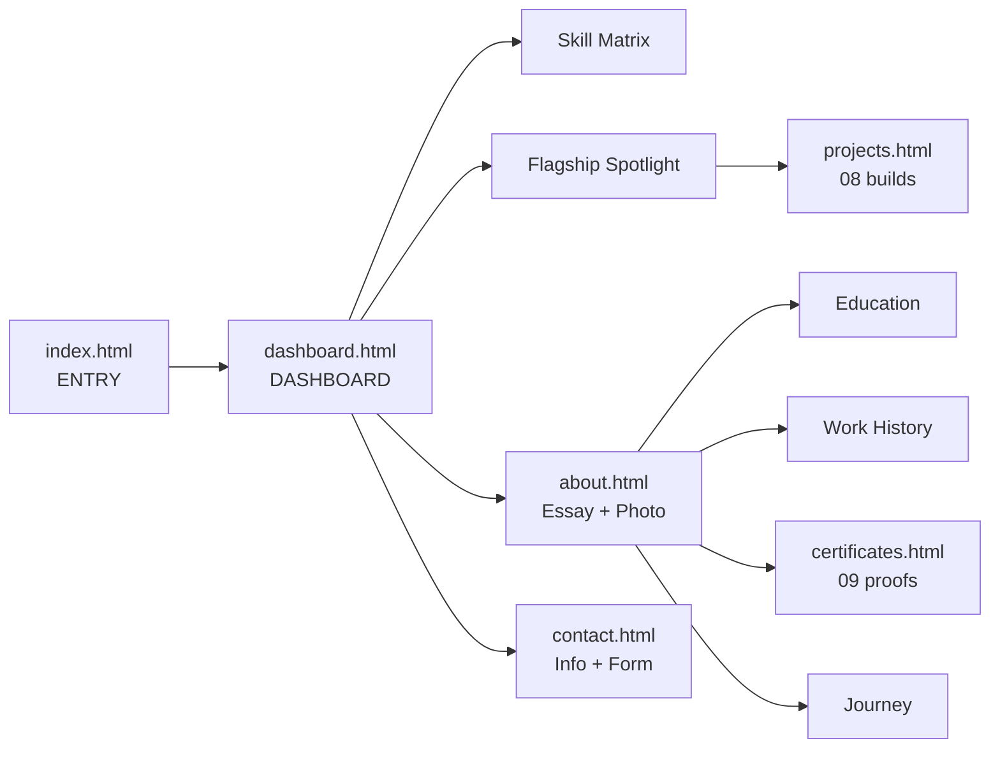

<div align="center">

```
╔══════════════════════════════════════════════╗
║                                              ║
║   ARKA PATRA  —  ~/security-lab              ║
║   Cyber Security · Security-Focused Dev      ║
║                                              ║
╚══════════════════════════════════════════════╝
```

### `~/security-lab` — Cyber Security Student · Security-Focused Developer · West Bengal, India

**Building secure software. Exploring cybersecurity. Turning ideas into working tools.**

[](./index.html)
[](./index.html)
[](./index.html)
[](./index.html)
[](./index.html)
[](./LICENSE)

`B.Sc Cyber Security @ GNIT` · `Python / JS` · `Web Security` · `System: ONLINE`

</div>

---

## 🖥️ Boot Sequence

```bash
arka@security-lab:~$ whoami
> arka-patra — cyber_security_student

arka@security-lab:~$ focus
> cybersecurity + artificial-intelligence + web-security + software-engineering

arka@security-lab:~$ ls --pages
> index.html(entry)  dashboard.html  projects.html  about.html  contact.html  certificates.html

arka@security-lab:~$ ls --proof
> assets/ holds all media: cert-*.pdf (x8) + internship-certificate + CV + profile-photo

arka@security-lab:~$ deploy --target=vercel
> https://portfolio-ten-gold-16.vercel.app/  ● LIVE

arka@security-lab:~$ status
> SYSTEM ONLINE ██████████ 100%
```

> A zero-dependency, dark-red **CY•FOCUS** portfolio. Four static HTML files. No framework. No build step. No backend. Just open and run.

---

## 🎛️ Control Deck — Live Pages

| Module | Route | Payload |
|---|---|---|
| 🟥 DASHBOARD | [`dashboard.html`](./dashboard.html) / [live](https://portfolio-ten-gold-16.vercel.app/dashboard.html) | Red device-panel hero, skill matrix, flagship spotlight |
| ⬜ LANDING | [`index.html`](./index.html) / [live](https://portfolio-ten-gold-16.vercel.app/) | Entry hero + View Portfolio → dashboard, contact only |
| 🟧 ARCHIVE | [`projects.html`](./projects.html) / [live](https://portfolio-ten-gold-16.vercel.app/projects.html) | All 08 builds, filters (All / Cybersecurity / Web Security), technical readouts |
| 🟨 DOSSIER | [`about.html`](./about.html) / [live](https://portfolio-ten-gold-16.vercel.app/about.html) | Essay, education, work history, journey, certificate spotlight |
| 🟩 UPLINK | [`contact.html`](./contact.html) / [live](https://portfolio-ten-gold-16.vercel.app/contact.html) | Info rail + validated message form |
| 🟪 PROOF | [`certificates.html`](./certificates.html) | Internship spotlight + 08 course certificates, all with PDF proofs and View Certificate buttons |

### 📊 System Readout

| Metric | Value |
|---|---|
| Pages | `06` |
| Live builds | `08` (05 featured) |
| Certificates | `08` + verified internship |
| PDF proofs | `09` files, one click away |
| Backend | `NONE` — pure static |
| Theme | `CY•FOCUS DARK + RED` |

---

## ⚡ What makes this different?

Not another generic template. This is a **threat-monitor styled portfolio**:

- 🔴 **Red Device Panel Hero** — canvas-rendered spinning wireframe globe (black on red, true Y-axis rotation, zero deps), silhouette, left-side Threat Monitor card, marquee tape (`CY•FOCUS / PASSWORD SECURITY / WEB SECURITY`)
- ⬛ **Flat official finish** — zero neon/glow anywhere: solid red-on-black, neutral depth shadows, crisp status colors; `prefers-reduced-motion` respected
- 🎞️ **Dual Infinite Marquee** — white + red tapes scrolling opposite directions, tilted -1.2deg
- 🧪 **Interactive Demos inside cards** — animated risk-meter, expandable technical breakdowns, filterable grid
- 👤 **Dossier-style About** — plain-text essay, profile card with photo + socials + Download CV button, education dossier, boxless work-history and journey essays, Thiranex certificate spotlight
- 📬 **Two-card Contact** — info rail + validated form (mailto fallback, no backend)
- 📱 **Device-friendly Full Screen** — 100vw layout, `100svh` hero, hamburger + fullscreen mobile menu, scroll-spy nav
- 👁️ **Reveal-on-scroll** — IntersectionObserver everywhere, zero libraries

---

## 🧰 Arsenal — Featured Builds

> ⚠️ **Disclaimer:** Educational / demo security tools to explore real concepts — not production security products. All analysis is 100% client-side; nothing leaves the browser unless noted.

| # | Project | Type | Live | Code |
|---|---------|------|------|------|
| 00 | **Website Security Copilot** `FEATURED` | Browser Extension + Web Security | [Live Demo](https://website-security-copilot-3m0hij8jl-arkap1502-9053s-projects.vercel.app/) | [Code](https://github.com/arkap1502/Website-Security-Copilot) |
| 01 | **Altron Password Inspector** `FEATURED` | Password Security | [Live Demo](https://arkap1502.github.io/password-making/) | [Code](https://github.com/arkap1502/password-making) |
| 02 | **URL Threat Scanner** | Phishing Detection | [Live Demo](https://arkap1502.github.io/URL-Scanner/) | [Code](https://github.com/arkap1502/URL-Scanner) |
| 03 | **NexVault** `FEATURED · GROUP · IN PROGRESS` | Secure Vault Web App | [Live Demo](https://secure-vault-system.onrender.com/) | — |
| 04 | **Humanize AI** `IN PROGRESS` | AI Text Tool | [Live Demo](https://arkap1502.github.io/Humanize-AI/) | [Code](https://github.com/arkap1502/Humanize-AI) |
| 05 | **Hidden-Prompt Scanner for Documents** `FEATURED` | Document Security · Prompt Injection Detection | [Live Demo](https://hidden-prompt-scanner-for-documents.onrender.com/) | [Code](https://github.com/arkap1502/Hidden-prompt-scanner-for-documents.) |
| 06 | **Prototype Safety Check** | Prototype Safety · Web Security | [Live Demo](https://prototype-safety-check.onrender.com/) | [Code](https://github.com/arkap1502/prototype-safety-check) |
| 07 | **Laptop Antivirus** `FEATURED` | Real-Time Protection · System Security | — (desktop app) | [Code](https://github.com/arkap1502/Antivirus) |

<details>
<summary><b>00 — Website Security Copilot ◈ Featured (click to expand)</b></summary>

AI-powered assistant that scans, explains, and helps fix website security issues — plus an Always-On browser guard.
- 🧩 **Primarily a browser extension** — the live demo shows the UI & lets you test a URL; full auto-guard needs Load unpacked (`extension/` folder)
- Manual Scan Mode: URL input → headers (`CSP`, `HSTS`, `X-Frame-Options`), SSL/TLS, cookies, open ports / fingerprinting, DNS-email (`SPF`, `DMARC`, `DKIM`) + AI risk score & plain-English fixes
- Always-On Guard Mode: ON/OFF toggle → auto-watches every site, instant verdict `Safe ✅ / Suspicious ⚠️ / Blocked ⛔`, auto-blocks harmful sites (force-open only when OFF)
- Every finding ships severity + evidence + why-it-matters + copy-paste fix (Nginx / Apache / Next.js); risk score `100 - min(100, 10*C + 5*H + 2*M + 1*L)`, grades A–F
- Passive-safe by default (normal requests only, `robots.txt` respected); AI only explains tool output, never invents findings
- Stack: Next.js + Tailwind, FastAPI, Python (`httpx`, `ssl`, `dnspython`), SQLite → Postgres, Docker, MV3 extension
</details>

<details>
<summary><b>01 — Altron Password Inspector (click to expand)</b></summary>

- `crypto.getRandomValues()` — never `Math.random()`
- Length / charset / punctuation controls, show-hide, copy, clear
- Live strength HUD · Fully client-side
</details>

<details>
<summary><b>02 — URL Threat Scanner (click to expand)</b></summary>

- Raw-IP, shady-TLD, brand-misspelling, phishing-keyword detection
- Per-finding explanations + verdict · Animated risk meter in-card
</details>

<details>
<summary><b>03 — NexVault ◈ Group Project (click to expand)</b></summary>

> *Your data, your vault, your control.*
- Auth-gated vault dashboard, encrypted access-controlled storage
- Green-glow `group-card` highlight + pulsing `IN PROGRESS` pill
</details>

<details>
<summary><b>04 — Humanize AI (click to expand)</b></summary>

React + Express app with **zero-build offline fallback** — same engine ported to vanilla JS for GitHub Pages. Light / Medium / Strong modes, real-time transform, word-count diff.
</details>

<details>
<summary><b>05 — Hidden-Prompt Scanner for Documents ◈ Featured (click to expand)</b></summary>

- Invisible-text heuristics — white-on-white, `< 2pt` / zero-size fonts, transparent text, off-page content, zero-width chars (`U+200B/C/D, U+FEFF`)
- Metadata / comments / footnotes / annotations scan + injection-phrase match
- `LOW / MEDIUM / HIGH` risk scoring · CLI + JSON report · Flask web UI · Fully local scan
</details>

<details>
<summary><b>06 — Prototype Safety Check (click to expand)</b></summary>

- 6 checks — SQLi, XSS, malware, phishing, DoS exposure, MitM (HTTPS / HSTS / TLS)
- Safe / Risky / Critical verdict with reasons + fix suggestions
- Web UI + `scanner.py` CLI + `GET /api/scan?url=...` API + re-scan history
</details>

<details>
<summary><b>07 — Laptop Antivirus ◈ Featured (click to expand)</b></summary>

- Auto ON at boot / OFF at shutdown + manual toggle with 15-min auto re-enable
- Real-time watch: apps, websites, images, videos, files, folders, USB
- Severity engine `CRITICAL / HIGH / MEDIUM / LOW` with Quarantine / Delete / Block + encrypted vault
- Stack: Python stdlib, Tkinter dashboard, `SHA-256` signatures, URL shield, `watchdog` / `plyer` optional
</details>

---

## 🗺️ Site Map



Global nav on every page: `DASHBOARD → ABOUT → CERTIFICATES → PROJECTS` + red `CONTACT` button → `contact.html`.

---

## 🧬 Skill Matrix

| Domain | Stack |
|--------|-------|
| ◇ Programming | Python · JavaScript · HTML · CSS · SQL |
| ◈ Cybersecurity | Web Security · Phishing Awareness · Password Security · Security Analysis · Fundamentals |
| ◆ Development | Flask · SQLite · Frontend · Responsive UI · REST / API concepts |
| ▣ OS | Windows 11 · Linux |
| ⚙ Tools | VS Code · Git · GitHub · Microsoft Office |
| ✦ Soft | Problem Solving · Communication · Teamwork · Logical Thinking · Continuous Learning |

---

## 👤 About Page

`about.html` holds the personal side in the same theme:

- **Essay + profile card** — plain-text narrative with focus/toolbox chips + CTAs; profile card with photo, `// cyber_security_student`, socials, and a Download CV button
- **Education** — dossier cards: B.Sc Cyber Security @ GNIT (2024 — Present), Higher Secondary (2024), Secondary (2022)
- **Work History** — one essay-style box: Thiranex internship (verified PDF) + Forage simulations + open-to-work in a single paragraph
- **Certificate spotlight (01)** — Thiranex internship card + `View All Certificates` button → [`certificates.html`](./certificates.html) (all 09 with PDF proofs)
- **Journey** — one essay-style box rewritten around the certificates

---

## 📬 Contact Page

`contact.html` is a standalone two-card layout:

- **Left rail** — `REPLIES WITHIN 24 HOURS` badge, channel rows (Email click-to-copy set to `arkap1502@gmail.com`, Phone, LinkedIn, GitHub), address card
- **Right card** — validated message form (name / email / message required); on submit it opens the visitor's mail app with a pre-filled email — **no backend**

---

## 🚀 Run it in 10 seconds

No install. No build. No dependencies.

**Option 1 — double-click:**
```bash
open index.html
# or just double-click index.html in Explorer
```

**Option 2 — local server (recommended):**
```bash
python3 -m http.server 8000
# visit → http://localhost:8000
```

**Fonts (CDN only):** Space Grotesk · Inter · JetBrains Mono

### File structure
```
portfolio/
├── index.html      → entry hero + View Portfolio → dashboard
├── dashboard.html  → dashboard (hero, skills, flagship spotlight)
├── projects.html   → full archive, all 08 builds with filters
├── about.html      → essay + photo + education + work + cert spotlight + journey
├── certificates.html → all 09 certificates + verified internship PDF
├── contact.html    → info rail + message form (two-card layout)
├── assets/         → all media in one folder, linked from the pages above
│   ├── arka-patra.jpg  → profile photo (about page)
│   ├── Arka_Patra_CV.pdf → CV download (dashboard + about buttons)
│   ├── cert-*.pdf (×8) → linked from certificates page cards
│   └── Thiranex_Certificate_Arka_Patra_THX-AUG0426-563.pdf → internship proof
├── README.md       → you are here
└── LICENSE         → MIT
```

### ☁️ Deploy notes (Vercel)
- Framework preset: **Other** · Root Directory: `./` (pages at repo root, media in `assets/`)
- No build command, no env vars · Every push auto-redeploys
- `assets/` must be committed or the PDF / photo / CV buttons 404

---

## 🎨 Design Tokens — CY FOCUS DARK + RED

```css
--bg: #131314;        --surface: #1c1c1f;
--cyan: #ff2e0e;      --green: #3dff88;
--amber: #ff5a1f;     --text: #f2efe9;
--font-display: 'Space Grotesk';
--font-body: 'Inter';
--font-mono: 'JetBrains Mono';
```

Glass cards: `linear-gradient(180deg, #202023, #171719)` + `0 0 0 4px #0b0b0c` ring + neutral black depth shadows (no colored glow anywhere). Selection: `rgba(255,46,14,0.4)`.

---

## 🔧 Make it yours — 5-min checklist

- [x] **CV button** — `#downloadCvBtn` in `dashboard.html` → `assets/Arka_Patra_CV.pdf` (committed, downloads directly)
- [x] **Email** — `data-copy` on `#emailBtn` in `contact.html` set to `arkap1502@gmail.com`
- [ ] **Phone** — `tel:+919748813115` in `contact.html` → your number
- [ ] **Socials** — hero + contact + footer URLs (GitHub / LinkedIn / X / Instagram / Threads)
- [ ] **Projects** — update Live Demo / Code links under `github.com/arkap1502` as repos move
- [ ] **Address** — `.c-addr` block in `contact.html` → your city

---

## 🌐 Browser Support

Modern evergreen: Chrome · Firefox · Safari · Edge. Uses `backdrop-filter`, CSS custom properties, `IntersectionObserver`, `crypto.getRandomValues()`, `navigator.clipboard`.

Respects `prefers-reduced-motion` — animations collapse to instant render.

---

## 📬 Connect — Let's Build Something Secure

<div align="center">

[](https://portfolio-ten-gold-16.vercel.app/)
[](https://github.com/arkap1502)
[](https://www.linkedin.com/in/arka-patra-579110422/)
[](https://x.com/arkap1502)
[](https://www.instagram.com/_its_me_chikuuuu/?hl=en)
[](https://www.threads.com/@_here_chikuu_005)

📞 `+91 97488 13115` · ✉️ `arkap1502@gmail.com` · 📍 Madhyamgram, North 24 Parganas, Kolkata 700130

</div>

---

## 📄 License

This project is licensed under the MIT License - see [LICENSE](./LICENSE) for details.

---

<div align="center">

© 2026 Arka Patra. Built with curiosity, code & security in mind. 🛡️

`whoami → arka-patra` · `focus → cybersecurity + development` · `status → STILL BUILDING`

`// END OF TRANSMISSION`

</div>
